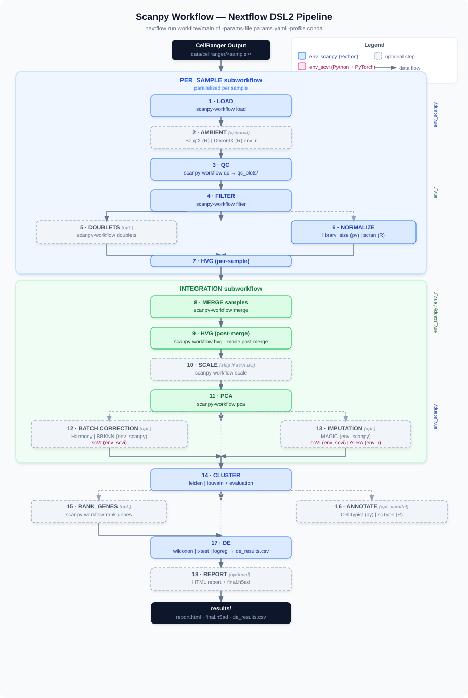

# scanpy_workflow

An end-to-end single-cell RNA-seq analysis pipeline built on [Scanpy](https://scanpy.readthedocs.io), [Nextflow DSL2](https://www.nextflow.io), and Bioconductor. It takes raw Cell Ranger output and produces clustered, annotated, and differentially expressed results as `.h5ad` files and an HTML report.



---

## Table of Contents

- [Features](#features)
- [Requirements](#requirements)
- [Installation](#installation)
- [Quick Start](#quick-start)
- [Configuration](#configuration)
- [Pipeline Steps](#pipeline-steps)
- [Differential Expression Methods](#differential-expression-methods)
- [Output Structure](#output-structure)
- [Running Tests](#running-tests)
- [Conda Environments](#conda-environments)
- [CI/CD](#cicd)

---

## Features

| Category | Options |
|---|---|
| Ambient RNA removal | SoupX, decontX |
| Doublet detection | Scrublet |
| Normalization | Library-size (scanpy), scran |
| Batch correction | Harmony, BBKNN, scVI |
| Imputation | MAGIC, scVI, ALRA |
| Clustering | Leiden, Louvain |
| Cell-type annotation | CellTypist, scType |
| Differential expression | Wilcoxon, t-test, logistic regression, MAST, DESeq2 pseudo-bulk |

All inter-process communication is via `.h5ad` files. The pipeline can run with conda, Docker, or Singularity.

---

## Requirements

| Tool | Version |
|---|---|
| Nextflow | ≥ 23.10 |
| conda / mamba | any recent |
| Python | 3.11 (managed by conda env) |
| R | 4.3 (managed by conda env) |

Nextflow and conda are the only tools you need on the host machine.

---

## Installation

### 1. Clone the repository

```bash
git clone https://github.com/<your-org>/scanpy_workflow.git
cd scanpy_workflow
```

### 2. Create conda environments

Three environments cover all pipeline steps:

```bash
# Python — scanpy, harmony, BBKNN, scrublet, celltypist, …
conda env create -f envs/env_scanpy.yaml

# Python + PyTorch — scVI-tools
conda env create -f envs/env_scvi.yaml

# R / Bioconductor — scran, SoupX, decontX, MAST, DESeq2, ALRA, scType
conda env create -f envs/env_r.yaml
```

Install GitHub-only R packages (ALRA, scType) after the conda environment is ready:

```bash
conda run -n env_r Rscript -e "remotes::install_github('nalab-stanford/ALRA')"
conda run -n env_r Rscript -e "remotes::install_github('IanevskiAleksandr/sc-type')"
```

### 3. Install the Python package

```bash
conda activate env_scanpy
pip install -e ".[dev]"
```

---

## Quick Start

### Minimal run (two samples, default settings)

```bash
nextflow run workflow/main.nf \
  -params-file params.yaml \
  -profile conda
```

`params.yaml` points to `data/cellranger/` by default. Place your Cell Ranger output directories there:

```
data/cellranger/
├── sample_A/          # filtered_feature_bc_matrix/ (and raw_feature_bc_matrix/ if ambient removal is on)
└── sample_B/
```

Then set the sample names in `params.yaml`:

```yaml
samples:
  - sample_A
  - sample_B
```

### Resume an interrupted run

```bash
nextflow run workflow/main.nf -params-file params.yaml -profile conda -resume
```

### Docker / Singularity

```bash
nextflow run workflow/main.nf -params-file params.yaml -profile docker
nextflow run workflow/main.nf -params-file params.yaml -profile singularity
```

---

## Configuration

All options live in `params.yaml`. Pass it with `-params-file params.yaml`. Every key has a default in `workflow/nextflow.config`; `params.yaml` overrides them.

### Full annotated example

```yaml
# --- I/O ---
input_dir: "data/cellranger/"       # parent directory; each sample is a subdirectory
output_dir: "results/"
samples:
  - sample_A
  - sample_B

# --- Ambient RNA removal (Step 2) ---
ambient:
  enabled: true
  method: soupx                      # soupx | decontx

# --- QC filtering thresholds (Step 4) ---
filter:
  min_genes: 200
  max_genes: 6000
  min_counts: 500
  max_counts: 30000
  max_pct_mito: 20                   # percent mitochondrial reads
  max_pct_ribo: 50                   # percent ribosomal reads
  min_cells: 3                       # minimum cells a gene must appear in

# --- Doublet detection (Step 5) ---
doublet:
  enabled: true
  method: scrublet

# --- Normalization (Step 6) ---
normalization:
  method: library_size               # library_size | scran
  target_sum: 10000                  # used only by library_size

# --- Highly variable genes (Steps 7, 9) ---
hvg:
  n_top_genes: 3000                  # per-sample HVG selection
  post_merge_n_top_genes: 2000       # post-merge HVG selection
  flavor: seurat_v3                  # seurat_v3 | seurat | cell_ranger

# --- PCA (Step 11) ---
pca:
  n_comps: 50

# --- Batch correction (Step 12) ---
batch_correction:
  enabled: true
  method: harmony                    # harmony | scvi | bbknn
  batch_key: sample                  # obs column used as batch label

# --- Imputation (Step 13, optional) ---
imputation:
  enabled: false
  method: magic                      # magic | scvi | alra
  evaluate: true                     # compute imputation quality metrics

# --- Clustering (Steps 14-15) ---
clustering:
  algorithm: leiden                  # leiden | louvain
  resolution: 0.5
  n_neighbors: 15
  evaluate: true                     # compute silhouette / Davies-Bouldin scores

# --- Cell-type annotation (Step 16) ---
annotation:
  unsupervised: true                 # rank marker genes per cluster
  automated: true                    # run automated classifier
  method: celltypist                 # celltypist | sctype
  celltypist_model: "Immune_All_Low.pkl"
  sctype_markers: null               # path to markers JSON; required if method: sctype

# --- Differential expression (Step 17) ---
de:
  method: wilcoxon                   # wilcoxon | t-test | logreg | mast | pseudobulk
  groupby: leiden                    # obs column to group cells by
  sample_key: sample                 # obs column with sample IDs (pseudobulk only)
  min_cells: 10                      # min cells per (cluster, sample) pseudo-bulk

# --- Report (Step 18) ---
report: true
```

---

## Pipeline Steps

The pipeline is split into two sub-workflows and a main orchestrator:

### PER_SAMPLE sub-workflow (Steps 1–7, parallelised per sample)

| Step | Process | Method |
|---|---|---|
| 1 | LOAD | Read Cell Ranger MEX or HDF5; store raw counts in `layers["counts"]` |
| 2 | AMBIENT *(optional)* | SoupX or decontX ambient RNA removal |
| 3 | QC | Compute `n_genes`, `n_counts`, `pct_counts_mt`, `pct_counts_ribo` |
| 4 | FILTER | Hard thresholds on QC metrics |
| 5 | DOUBLETS *(optional)* | Scrublet doublet scores; flag or remove doublets |
| 6 | NORMALIZE | Library-size (`log1p` to `layers["log_norm"]`) or scran |
| 7 | HVG\_PER\_SAMPLE | Select highly variable genes per sample |

### INTEGRATION sub-workflow (Steps 8–13)

| Step | Process | Method |
|---|---|---|
| 8 | MERGE | Concatenate per-sample `.h5ad`; add `batch_key` column |
| 9 | HVG\_POST\_MERGE | Consensus HVG selection across samples |
| 10 | SCALE *(skipped for scVI path)* | Z-score; clip at `max_value=10` |
| 11 | PCA | `n_comps` principal components |
| 12 | BATCH\_CORRECT *(optional)* | Harmony (corrects `X_pca`), BBKNN (graph-level), or scVI (latent space) |
| 13 | IMPUTE *(optional)* | MAGIC, scVI, or ALRA |

### Downstream (Steps 14–18, main.nf)

| Step | Process | Notes |
|---|---|---|
| 14–15 | CLUSTER | KNN graph → Leiden/Louvain; optional silhouette evaluation |
| 16a | RANK\_GENES | Unsupervised marker gene ranking per cluster |
| 16b | ANNOTATE | CellTypist (pre-trained model) or scType (custom markers) |
| 17 | DE | Differential expression (see below) |
| 18 | REPORT | HTML report + final `.h5ad` |

---

## Differential Expression Methods

All DE methods write a CSV with the same columns:

| Column | Description |
|---|---|
| `group` | Cluster label (one-vs-rest) |
| `gene` | Gene name |
| `score` | Method-specific ranking score |
| `logfoldchange` | Log fold change (in-cluster mean minus rest mean, or log2FC for DESeq2) |
| `pval` | Raw p-value |
| `pval_adj` | BH-adjusted p-value (per cluster) |

### Wilcoxon / t-test / logistic regression

Scanpy's `rank_genes_groups` implementation. Fast, no extra dependencies. Good for large datasets.

```yaml
de:
  method: wilcoxon   # or t-test | logreg
  groupby: leiden
```

### MAST (hurdle model)

Fits a two-component hurdle model (continuous + discrete) per cluster using [MAST](https://bioconductor.org/packages/MAST/). Accounts for zero-inflation and cellular detection rate (`ngeneson` covariate). Score = `sign(LFC) × √λ_hurdle`.

```yaml
de:
  method: mast
  groupby: leiden
```

Requires: `bioconductor-mast` (included in `env_r.yaml`).

### Pseudo-bulk DESeq2

Aggregates raw counts per (cluster × sample), then runs [DESeq2](https://bioconductor.org/packages/DESeq2/) Wald test. Recommended for multi-sample experiments. Clusters with fewer than 2 samples meeting the `min_cells` threshold are skipped. Score = Wald statistic.

```yaml
de:
  method: pseudobulk
  groupby: leiden
  sample_key: sample   # obs column containing sample IDs
  min_cells: 10        # minimum cells per (cluster, sample) pseudo-replicate
```

Requires: `bioconductor-deseq2` (included in `env_r.yaml`) and at least 2 samples in your dataset.

---

## Output Structure

```
results/
├── de/
│   └── de_results.csv               # DE table (all clusters)
├── clustering/
│   ├── clustered.h5ad
│   └── cluster_evaluation/
├── annotation/
│   ├── annotated.h5ad
│   └── celltypist_results/
├── report/
│   └── report.html                  # Summary report
├── nextflow_report.html             # Nextflow execution report
└── timeline.html                    # Nextflow timeline
```

The final `.h5ad` contains:

| Slot | Content |
|---|---|
| `adata.X` | `log1p`-normalised expression (`layers["log_norm"]`) |
| `layers["counts"]` | Raw integer counts |
| `layers["norm"]` | Normalised counts (pre-log) |
| `layers["log_norm"]` | log1p-normalised counts |
| `obsm["X_pca"]` | PCA embedding |
| `obsm["X_umap"]` | UMAP embedding |
| `obs["leiden"]` | Cluster labels |
| `obs["celltypist_cell_type"]` | CellTypist predictions (if enabled) |
| `obs["sctype_cell_type"]` | scType predictions (if enabled) |

---

## Running Tests

### Python unit tests

```bash
conda activate env_scanpy
pip install -e ".[dev]"
pytest tests/unit/ -v
```

Skipped automatically if optional environments (scVI, MAGIC) are not available.

### R unit tests

```bash
conda activate env_r
Rscript -e "testthat::test_dir('tests/unit/r/', reporter = 'progress')"
```

Individual test files:

```bash
Rscript tests/unit/r/test_mast.R
Rscript tests/unit/r/test_pseudobulk.R
Rscript tests/unit/r/test_scran.R
Rscript tests/unit/r/test_soupx.R
Rscript tests/unit/r/test_decontx.R
Rscript tests/unit/r/test_alra.R
Rscript tests/unit/r/test_sctype.R
```

### Integration / smoke test

Requires Nextflow and the `env_scanpy` conda environment:

```bash
conda activate env_scanpy
pytest tests/integration/ -v
```

---

## Conda Environments

| File | Label in Nextflow | Used by |
|---|---|---|
| `envs/env_scanpy.yaml` | `scanpy` | All Python steps (load, QC, normalize, HVG, PCA, batch-correct, cluster, annotate, DE, report) |
| `envs/env_scvi.yaml` | `scvi` | scVI batch correction, scVI imputation |
| `envs/env_r.yaml` | `r_env` | scran, SoupX, decontX, ALRA, scType, MAST, DESeq2 |

Nextflow selects the correct environment automatically based on the `label` declared in each module. You only need the environments for the steps you enable.

---

## CI/CD

GitHub Actions runs three jobs on every push:

| Job | Trigger | What it does |
|---|---|---|
| `python-unit` | every push | `pytest tests/unit/` with Python 3.11 |
| `r-unit` | every push | `testthat::test_dir('tests/unit/r/')` with R 4.3 |
| `integration` | pull request to `main` | Full Nextflow smoke test with conda |

See `.github/workflows/ci.yml` for details.
